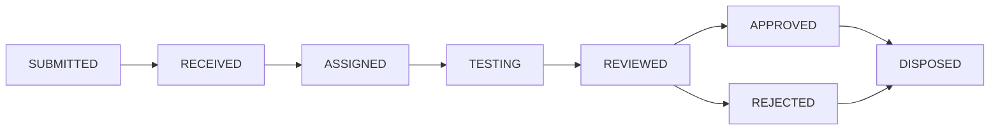

# SỔ TAY HƯỚNG DẪN SỬ DỤNG HỆ THỐNG VITALYS LIMS / SDMS / ELN
### Nền Tảng Quản Lý Phòng Thí Nghiệm & Dữ Liệu Khoa Học Dược Phẩm Toàn Diện
> **Phiên bản tài liệu**: 1.0.0 (Phát hành chính thức)  
> **Tiêu chuẩn tuân thủ**: FDA 21 CFR Part 11, EU Annex 11, GxP, ICH Q1A/Q1E, ALCOA+ Data Integrity  
> **Đối tượng áp dụng**: Ban Giám Đốc, Trưởng Phòng QC/QA, Kiểm Nghiệm Viên (Analyst), Quản Trị Hệ Thống (SysAdmin)

---

## MỤC LỤC TỔNG QUAN

1. [TỔNG QUAN HỆ THỐNG & CHUẨN MỰC TUÂN THỦ](#1-tổng-quan-hệ-thống--chuẩn-mực-tuân-thủ)
2. [TÀI KHOẢN ĐĂNG NHẬP & PHÂN QUYỀN TRUY CẬP](#2-tài-khoản-đăng-nhập--phân-quyền-truy-cập)
3. [BẢNG ĐIỀU HÀNH TRUNG TÂM LAB (EXECUTIVE DASHBOARD)](#3-bảng-điều-hành-trung-tâm-lab-executive-dashboard)
4. [QUẢN TRỊ NGƯỜI DÙNG & NHẬT KÝ KIỂM TOÁN (AUDIT TRAIL)](#4-quản-trị-người-dùng--nhật-ký-kiểm-toán-audit-trail)
5. [DỮ LIỆU GỐC: THIẾT BỊ, ĐỐI TÁC & SẢN PHẨM (MASTER DATA)](#5-dữ-liệu-gốc-thiết-bị-đối-tác--sản-phẩm-master-data)
6. [PHƯƠNG PHÁP THỬ, TIÊU CHUẨN CHẤT LƯỢNG & FORM ĐỘNG ELN](#6-phương-pháp-thử-tiêu-chuẩn-chất-lượng--form-động-eln)
7. [QUẢN LÝ VÒNG ĐỜI MẪU & CHUỖI GIÁM SÁT (CHAIN OF CUSTODY)](#7-quản-lý-vòng-đời-mẫu--chuỗi-giám-sát-chain-of-custody)
8. [WORKLIST KIỂM NGHIỆM VIÊN & THỰC THI PHÂN TÍCH](#8-worklist-kiểm-nghiệm-viên--thực-thi-phân-tích)
9. [KIỂM SOÁT LỆCH CHUẨN OOS & ĐIỀU TRA NGUYÊN NHÂN](#9-kiểm-soát-lệch-chuẩn-oos--điều-tra-nguyên-nhân)
10. [PHÊ DUYỆT 2 CẤP, CHỮ KÝ SỐ 21 CFR PART 11 & PHIẾU COA](#10-phê-duyệt-2-cấp-chữ-ký-số-21-cfr-part-11--phiếu-coa)
11. [KHO DỮ LIỆU KHOA HỌC THÔ (SDMS) & UNIVERSAL VIEWER](#11-kho-dữ-liệu-khoa-học-thô-sdms--universal-viewer)
12. [NGHIÊN CỨU ĐỘ ỔN ĐỊNH THUỐC (STABILITY TESTING - ICH)](#12-nghiên-cứu-độ-ổn-định-thuốc-stability-testing---ich)
13. [QUẢN LÝ KHO HÓA CHẤT, DUNG MÔI & NHẬT KÝ PHA CHẾ](#13-quản-lý-kho-hóa-chất-dung-môi--nhật-ký-pha-chế)
14. [CHÍNH SÁCH LƯU TRỮ (DATA RETENTION) & KHÓA PHÁP LÝ (LEGAL HOLD)](#14-chính-sách-lưu-trữ-data-retention--khóa-pháp-lý-legal-hold)
15. [TÍCH HỢP HỆ THỐNG DOANH NGHIỆP (ERP / SAP & WEBHOOKS)](#15-tích-hợp-hệ-thống-doanh-nghiệp-erp--sap--webhooks)
16. [PHỤ LỤC & XỬ LÝ SỰ CỐ THƯỜNG GẶP](#16-phụ-lục--xử-lý-sự-cố-thường-gặp)

---

## 1. TỔNG QUAN HỆ THỐNG & CHUẨN MỰC TUÂN THỦ

**Vitalys** là giải pháp phần mềm cấp doanh nghiệp tích hợp đồng thời 3 hệ thống trụ cột cho phòng kiểm nghiệm dược phẩm hiện đại:
1. **LIMS (Laboratory Information Management System)**: Quản lý toàn diện vòng đời mẫu, yêu cầu thử nghiệm, phân công công việc, thiết bị và chứng nhận xuất xưởng (COA).
2. **SDMS (Scientific Data Management System)**: Thu thập tự động, lưu trữ an toàn, băm toàn vẹn SHA-256 và hiển thị đồ thị phổ/sắc ký thô từ các máy phân tích (HPLC, GC, UV-Vis, FTIR, MS).
3. **ELN (Electronic Laboratory Notebook)**: Biểu mẫu ghi chép phân tích điện tử động, kiểm soát sửa đổi số liệu và sổ tay pha chế hóa chất.

### Nguyên Tắc Toàn Vẹn Dữ Liệu ALCOA+
- **Attributable (Quy trách nhiệm)**: Mọi thao tác đều gắn liền với định danh người thực hiện, vai trò và địa chỉ IP.
- **Legible (Rõ ràng, đọc được)**: Bản ghi lưu trữ vĩnh viễn, truy xuất được qua thời gian.
- **Contemporaneous (Kịp thời)**: Dữ liệu được ghi nhận ngay tại thời điểm thao tác diễn ra theo chuẩn UTC/OffsetDateTime.
- **Original (Nguyên bản)**: Dữ liệu thô từ máy phân tích được bảo toàn với mã băm toàn vẹn SHA-256.
- **Accurate (Chính xác)**: Kết quả phân tích được kiểm soát bởi các công thức tính toán và phạm vi tiêu chuẩn tự động.
- **Complete, Consistent, Enduring, Available**: Bản ghi kiểm toán đầy đủ, nhất quán, bền bỉ và sẵn sàng phục vụ thanh tra.

---

## 2. TÀI KHOẢN ĐĂNG NHẬP & PHÂN QUYỀN TRUY CẬP

### 2.1. Cổng Đăng Nhập
- **Địa chỉ truy cập**: `http://<domain-hoặc-ip>:4200/auth` (Mặc định local: `http://localhost:4200/auth`)
- Nhập tên đăng nhập (**Username**) và mật khẩu (**Password**). Hệ thống cấp phát JWT Token có hiệu lực và tự động chuyển hướng về Trang Điều Hành.

### 2.2. Danh Sách Tài Khoản Mẫu Theo Vai Trò (Default Accounts)

| Tên Đăng Nhập | Mật Khẩu | Vai Trò (Role) | Chức Năng Chính |
| :--- | :--- | :--- | :--- |
| **admin** | `Admin@123` | **IT_ADMIN** | Toàn quyền cấu hình hệ thống, phân quyền, người dùng, chính sách lưu trữ |
| **labadmin** | `Admin@123` | **LAB_ADMIN** | Quản lý phương pháp thử, tiêu chuẩn, thiết bị, đặt lệnh Khóa Pháp Lý |
| **supervisor** | `Admin@123` | **QA_SUPERVISOR** | Phân công worklist, duyệt kết quả cấp 1, ký duyệt OOS, theo dõi tiến độ |
| **manager** | `Admin@123` | **QA_DIRECTOR** | Phê duyệt cấp 2, ký số COA xuất xưởng 21 CFR Part 11, thanh tra dữ liệu |
| **operator** | `Admin@123` | **QC_ANALYST** | Thực hiện phân tích, nhập liệu form ELN, pha chế hóa chất, xem worklist |
| **itadmin** | `Admin@123` | **SYSTEM_ADMIN** | Quản trị hạ tầng máy chủ, nhật ký kết nối ERP và sao lưu SDMS |

---

## 3. BẢNG ĐIỀU HÀNH TRUNG TÂM LAB (EXECUTIVE DASHBOARD)

### 3.1. Đường Dẫn Truy Cập
- Nhấp chọn **Dashboard** trên thanh điều hướng hoặc truy cập [`/dashboard`](http://localhost:4200/dashboard).

### 3.2. Ý Nghĩa Các Chỉ Số Hiệu Suất Cốt Lõi (Executive KPIs)
1. **Tổng Mẫu Tiếp Nhận**: Tổng số lượng mẫu đã nhập kho lab; kèm chỉ số **Mẫu tồn đọng (Backlog)** đang trong tiến trình phân tích.
2. **Phép Thử & Tỷ Lệ FTR (%)**: Tổng số phép thử đã hoàn tất và tỷ lệ **Đúng ngay từ lần đầu (First Time Right)**. FTR $\ge 90\%$ phản ánh chất lượng thao tác đạt chuẩn xuất sắc.
3. **Phiếu COA Đã Ban Hành**: Tổng số chứng nhận kiểm nghiệm đã được ký số đầy đủ 2 cấp; hiển thị **Thời gian chu chuyển trung bình (Average TAT)** từ lúc tiếp nhận mẫu đến lúc duyệt COA (chuẩn công nghiệp: $2.4$ ngày).
4. **Tỷ Lệ Lệch Chuẩn OOS (%)**: Tỷ lệ phần trăm phép thử có kết quả vượt tiêu chuẩn. Hệ thống gắn cờ màu xanh nếu $\le 5\%$ (Đạt chuẩn GMP) và cờ đỏ cảnh báo nếu $> 5\%$.
5. **Thiết Bị Phòng Lab**: Số lượng thiết bị đang trong trạng thái vận hành (`IN_SERVICE`) trên tổng số thiết bị và **Tỷ lệ khả dụng (Utilization Rate %)**.
6. **Hóa Chất Sắp Hết Hạn**: Số lượng lô hóa chất/dung môi/chất chuẩn có hạn dùng còn dưới $30$ ngày, giúp quản lý kho chủ động đặt hàng.
7. **Banner Lệnh Pháp Lý (Legal Hold Active)**: Xuất hiện màu hổ phách cảnh báo khi có các mẫu/lô thuốc đang bị khóa cứng do thanh tra FDA hoặc tranh chấp chất lượng.

### 3.3. Các Biểu Đồ Tương Tác ECharts
- **Thông lượng kiểm nghiệm hàng tháng (Throughput Trend)**: Đối chiếu 3 trục dữ liệu (Mẫu tiếp nhận, Phép thử hoàn thành, Phiếu COA ban hành) trong 6 tháng gần nhất để đánh giá tải phòng lab.
- **Phân loại nguyên nhân OOS (RCA Donut)**: Phân bổ tỷ lệ nguyên nhân gốc rễ (Dung môi, Cột sắc ký, Lỗi thao tác, Thiết bị).
- **Phân bổ trạng thái thiết bị**: Trực quan hóa thiết bị Đang vận hành, Đang bảo dưỡng/hiệu chuẩn và Thiết bị dự phòng.

### 3.4. Xuất Báo Cáo Điều Hành
- Nhấp nút **"Xuất Báo Cáo Điều Hành"** ở góc trên bên phải để mở chế độ in ấn/lưu PDF chuẩn hóa theo tiêu chuẩn báo cáo quản trị.

---

## 4. QUẢN TRỊ NGƯỜI DÙNG & NHẬT KÝ KIỂM TOÁN (AUDIT TRAIL)

### 4.1. Quản Trị Người Dùng (`/users`)
- Xem danh sách nhân viên, tài khoản, trạng thái (`ACTIVE`, `LOCKED`).
- Thêm mới người dùng, gán vào Phòng Ban (Phòng Hóa Lý, Phòng Vi Sinh, Phòng QA) và gán Vai trò (Role).
- Khóa tài khoản khi nhân viên nghỉ việc hoặc vi phạm quy chế bảo mật.

### 4.2. Ma Trận Phân Quyền (`/roles`)
- Cấu hình chi tiết quyền hạn theo cơ chế **RBAC** theo định dạng `MODULE:SCREEN:ACTION` (VD: `SAMPLE:SAMPLE:APPROVE`, `APPROVAL:REPORT:SIGN`).

### 4.3. Nhật Ký Kiểm Toán ALCOA+ 21 CFR Part 11 (`/audit`)
- **Tự động ghi vết 100%**: Mọi hành vi Thêm (INSERT), Sửa (UPDATE), Xóa/Khóa (DELETE/LOCK) đều được hệ thống tự động lưu vào bảng `sys_audit_trail`.
- **Nội dung lưu vết**:
  - Tên bảng / Module tác động.
  - Mã định danh bản ghi (Entity ID).
  - Loại hành động (`CREATE`, `UPDATE`, `DELETE`, `STATE_TRANSITION`, `E_SIGNATURE`).
  - Giá trị trước khi sửa (`Old Value`) và Giá trị sau khi sửa (`New Value`) dưới dạng JSON.
  - Người thực hiện (Username) và Thời điểm chính xác đến mili-giây.
- **Chính sách**: Nhật ký kiểm toán không thể bị sửa hoặc xóa bởi bất kỳ người dùng nào (kể cả Super Admin).

---

## 5. DỮ LIỆU GỐC: THIẾT BỊ, ĐỐI TÁC & SẢN PHẨM (MASTER DATA)

### 5.1. Quản Lý Thiết Bị Phân Tích (`/equipment`)
1. **Thêm mới thiết bị**: Nhập Mã thiết bị (VD: `EQ-HPLC-001`), Tên (Waters ACQUITY UPLC), Hãng sản xuất, Model, Số serial, Vị trí phòng máy và Chu kỳ hiệu chuẩn (VD: 180 ngày).
2. **Ghi nhật ký Hiệu Chuẩn (Calibration)**:
   - Nhấp vào thiết bị $\rightarrow$ chọn **Thêm bản ghi hiệu chuẩn**.
   - Nhập ngày hiệu chuẩn, đơn vị thực hiện, số chứng chỉ hiệu chuẩn và kết luận (Đạt / Không đạt).
   - Hệ thống tự động cộng dồn chu kỳ để tính **Ngày hiệu chuẩn tiếp theo (Next Due Date)** và cập nhật cờ thiết bị.
3. **Ghi nhật ký Bảo Dưỡng (Maintenance)**:
   - Ghi nhận bảo dưỡng định kỳ hoặc khắc phục sự cố (thay seal, thay đèn D2, vệ sinh buồng bơm).

### 5.2. Quản Lý Khách Hàng & Dự Án (`/partners`)
- **Khách hàng**: Đăng ký các công ty dược phẩm, đối tác gia công kiểm nghiệm hoặc các nhà máy nội bộ.
- **Dự án (Projects)**: Gắn kết các hợp đồng phân tích hoặc các chương trình nghiên cứu tương đương sinh học (BE).

### 5.3. Sản Phẩm & Lô Sản Xuất (`/products`)
- **Danh mục sản phẩm**: Quản lý tên thuốc, mã sản phẩm (VD: `PRD-PARA-500`), dạng bào chế (Viên nén, Dung dịch tiêm, Hỗn dịch), đường dùng và hạn sử dụng chuẩn (tháng).
- **Lô sản xuất (`/products/batches`)**:
  - Khai báo số lô (VD: `BATCH-260101`), ngày sản xuất, ngày hết hạn và quy mô lô (VD: 500,000 viên).
  - Trạng thái lô: `QUARANTINE` (Đang biệt trữ chờ kiểm), `RELEASED` (Đã xuất xưởng), `REJECTED` (Không đạt).

---

## 6. PHƯƠNG PHÁP THỬ, TIÊU CHUẨN CHẤT LƯỢNG & FORM ĐỘNG ELN

### 6.1. Phương Pháp Phân Tích & SOPs (`/methods`)
- **Khai báo phương pháp**: Mã SOP (VD: `SOP-HPLC-001`), tên phương pháp, phiên bản (Version), tài liệu viện dẫn (Dược điển USP/BP/EP).
- **Vòng đời phương pháp**:
  - `DRAFT`: Đang biên soạn.
  - `VALIDATED`: Đã thẩm định phương pháp phân tích theo ICH Q2(R1) $\rightarrow$ sẵn sàng dùng cho phân tích chính thức.
  - `SUPERSEDED`: Đã có phiên bản mới thay thế.

### 6.2. Tiêu Chuẩn Chất Lượng Sản Phẩm (`/methods/specifications`)
- Mỗi sản phẩm gắn liền với một hoặc nhiều bộ tiêu chuẩn (Tiêu chuẩn xuất xưởng, Tiêu chuẩn xuất khẩu, Tiêu chuẩn độ ổn định).
- **Khai báo các chỉ tiêu (Specification Items)**:
  - *Chỉ tiêu định lượng*: Tên chỉ tiêu (Hàm lượng hoạt chất), Phương pháp thử áp dụng, Đơn vị tính (`%`), Giới hạn dưới ($95.0\%$), Giới hạn trên ($105.0\%$).
  - *Chỉ tiêu định tính / Giới hạn*: Độ rã ($\le 15$ phút), Độ đồng đều khối lượng ($\pm 5\%$), Tạp chất liên quan ($\le 0.1\%$).

### 6.3. Biểu Mẫu Nhập Liệu Động ELN (Form Templates)
- Hệ thống hỗ trợ định nghĩa cấu trúc JSON Schema cho phép tạo các form nhập số liệu đặc thù cho từng dạng phép thử: Cân khối lượng mẫu, Độ hấp thụ quang (Absorbance), Diện tích pic HPLC, Thể tích chuẩn độ.

---

## 7. QUẢN LÝ VÒNG ĐỜI MẪU & CHUỖI GIÁM SÁT (CHAIN OF CUSTODY)

### 7.1. Tiếp Nhận Yêu Cầu Kiểm Nghiệm (`/samples/requests`)
1. Tạo phiếu yêu cầu kiểm nghiệm (**Test Request**): Chọn Khách hàng/Dự án, Sản phẩm, Lô sản xuất, Loại mẫu (Thành phẩm, Bán thành phẩm, Nguyên liệu, Mẫu lưu).
2. Chọn các chỉ tiêu hoặc bộ tiêu chuẩn chất lượng cần phân tích.

### 7.2. Lấy Mẫu & Đăng Ký Mẫu Vào Hệ Thống (`/samples`)
1. Nhân viên lấy mẫu truy cập **Quản lý Mẫu** $\rightarrow$ chọn **Tiếp nhận mẫu (Accession Samples)**.
2. Hệ thống tự động sinh:
   - **Mã mẫu duy nhất**: `SMP-YYYYMMDD-XXXX` (VD: `SMP-20260928-0001`).
   - **Mã vạch chuẩn**: `BAR-SMP-YYYYMMDD-XXXX`.
3. In tem nhãn mã vạch (Barcode / QR Code kích thước chuẩn $50\text{mm} \times 30\text{mm}$) dán trực tiếp lên chai/lọ mẫu.

### 7.3. Máy Trạng Thái Mẫu (State Machine)
Mẫu chuyển tiếp nghiêm ngặt qua các trạng thái:

- Mọi bước chuyển trạng thái đều bắt buộc nhập lý do và được lưu vào `SampleStatusHistory`.

### 7.4. Chuỗi Giám Sát Vị Trí (Chain of Custody - CoC)
- Khi chuyển giao mẫu giữa các nhân sự hoặc phòng ban:
  - Nhấp nút **"Chuyển giao mẫu (Transfer Custody)"**.
  - Chọn người nhận mới, vị trí lưu trữ mới (VD: Kho mẫu mát tủ 02, Khay A3).
  - Nhập mục đích chuyển giao (VD: "Bàn giao mẫu cho KNV thực hiện định lượng HPLC").
  - Hệ thống ghi vết thời gian thực, phục vụ truy vết chuỗi bảo quản mẫu khi xảy ra tranh chấp.

---

## 8. WORKLIST KIỂM NGHIỆM VIÊN & THỰC THI PHÂN TÍCH

### 8.1. Bàn Làm Việc Phân Tích (`/testing/worklist`)
- Kiểm nghiệm viên truy cập **Worklist**:
  - Hệ thống tự động lọc các phép thử được phân công đích danh cho tài khoản đang đăng nhập.
  - Phép thử được sắp xếp theo mức độ ưu tiên (`URGENT`, `HIGH`, `NORMAL`) và hạn hoàn thành (Due Date).
  - Trạng thái phép thử: `ASSIGNED` (Được giao), `IN_PROGRESS` (Đang chạy), `COMPLETED` (Đã xong).

### 8.2. Thực Thi Phân Tích & Ghi Nhận Số Liệu ELN (`/testing/execute/{id}`)
1. **Chọn thiết bị phân tích**: Kiểm nghiệm viên quét mã thiết bị hoặc chọn từ danh sách thiết bị đang khả dụng (`IN_SERVICE`).
2. **Khai báo lượt chạy máy (Analytical Run)**: Nhập mã lượt chạy (VD: `RUN-HPLC-20260928-01`), số lượng mẫu tiêm (Injections).
3. **Nhập kết quả theo biểu mẫu ELN**:
   - Nhập các thông số thực nghiệm (Khối lượng cân bì, cân mẫu, thể tích pha loãng, hệ số hiệu chỉnh).
   - Nhập giá trị kết quả cuối cùng (Final Result Value).
4. **Kiểm tra tự động với Tiêu chuẩn (Auto Spec Evaluation)**:
   - Hệ thống tự động so sánh giá trị vừa nhập với khoảng Min - Max của tiêu chuẩn:
     - Nếu nằm trong khoảng: Đánh dấu **PASS** (Màu xanh).
     - Nếu nằm ngoài khoảng: Đánh dấu **FAIL** và tự động bật cờ cảnh báo **OOS**.

### 8.3. Toàn Vẹn Dữ Liệu: Lịch Sử Sửa Kết Quả (Result Revision)
- **Quy tắc ALCOA+**: Hệ thống **nghiêm cấm** việc xóa hoặc sửa đè trực tiếp kết quả đã nhập.
- Khi cần điều chỉnh (VD: phát hiện sai số tính toán thể tích pha loãng):
  - Nhấp **"Hiệu chỉnh kết quả (Revise Result)"**.
  - Nhập giá trị mới.
  - **Bắt buộc nhập lý do giải trình chi tiết** (VD: "Hiệu chỉnh hệ số pha loãng từ 100 lên 105 theo ghi chép sổ tay phân tích").
  - Hệ thống bảo lưu giá trị cũ (`oldValue`), giá trị mới (`newValue`), người sửa và thời gian sửa vào bảng `TestResultRevision`.

---

## 9. KIỂM SOÁT LỆCH CHUẨN OOS & ĐIỀU TRA NGUYÊN NHÂN

### 9.1. Tự Động Kích Hoạt Hồ Sơ OOS
- Ngay khi một kết quả phân tích có giá trị vi phạm tiêu chuẩn, hệ thống tự động:
  1. Đánh dấu cờ `isOOS = true`.
  2. Tự động sinh mã hồ sơ điều tra OOS: `OOS-YYYYMMDD-XXXX`.
  3. Gửi thông báo đến Quản lý phòng lab (Supervisor) và QA.

### 9.2. Quy Trình Điều Tra OOS 2 Giai Đoạn (`/testing/oos`)
1. **Giai đoạn 1: Điều tra tại phòng thí nghiệm (Phase 1 Lab Investigation)**:
   - Kiểm tra thiết bị phân tích: Áp suất, rò rỉ dung môi, hiệu năng đầu dò.
   - Kiểm tra chất chuẩn và dung môi: Hạn dùng, số lô pha chế.
   - Kiểm tra sai sót thao tác của kiểm nghiệm viên.
   - Ghi biên bản phỏng vấn kiểm nghiệm viên và phân tích mẫu trắng/mẫu chuẩn đối chứng.
2. **Quyết định thử nghiệm lại (Retest Approval)**:
   - Supervisor xem xét và phê duyệt kế hoạch Retest (Chỉ định KNV độc lập thực hiện lặp lại $n=3$ hoặc $n=6$).
3. **Giai đoạn 2: Điều tra quy trình sản xuất (Manufacturing Investigation)**:
   - Nếu điều tra lab không tìm thấy lỗi thao tác, chuyển hồ sơ sang bộ phận QA/Sản xuất để kiểm tra thông số vận hành máy dập viên, trộn hạt hoặc nguồn nguyên liệu.
4. **Kết luận & Hành Động Khắc Phục (CAPA)**:
   - Đóng hồ sơ OOS với kết luận: Lỗi do kiểm nghiệm viên / Lỗi thiết bị / Lỗi thực sự của lô sản phẩm.

---

## 10. PHÊ DUYỆT 2 CẤP, CHỮ KÝ SỐ 21 CFR PART 11 & PHIẾU COA

### 10.1. Quy Trình Phê Duyệt 2 Cấp (Dual-Level Workflow)
```
Kiểm Nghiệm Viên (Hoàn tất kết quả)
           │
           ▼
Cấp 1: Trưởng Phòng Lab / Supervisor (Review & Verify)
           │
           ▼
Cấp 2: Giám Đốc Đảm Bảo Chất Lượng / QA Director (Approve & Sign COA)
```

### 10.2. Chữ Ký Điện Tử Tuân Thủ 21 CFR Part 11
- Khi thực hiện phê duyệt, hệ thống mở hộp thoại Chữ Ký Điện Tử yêu cầu:
  1. **Xác thực danh tính**: Nhập lại mật khẩu đăng nhập cá nhân (Re-authentication).
  2. **Mục đích ký (Meaning of Signature)**:
     - *"Tôi xác nhận đã kiểm tra toàn bộ dữ liệu thô và phép tính phù hợp SOP"* (Cấp 1).
     - *"Tôi phê duyệt xuất xưởng lô thuốc và chịu trách nhiệm pháp lý về phiếu COA"* (Cấp 2).
  3. **Băm mã toàn vẹn SHA-256**: Hệ thống tạo chữ ký điện tử gồm mã hash toàn bộ nội dung kết quả, thời gian ký (UTC) và thông tin người ký. Chữ ký không thể bị giả mạo hoặc gán ghép sang tài liệu khác.

### 10.3. Xuất Phiếu Kiểm Nghiệm COA Bản In / PDF (`/reports`)
- Sau khi được QA Director ký duyệt cấp 2:
  - Hệ thống tự động tạo **Phiếu Kiểm Nghiệm (Certificate of Analysis - COA)** chuẩn GMP.
  - Phiếu COA bao gồm:
    - Tiêu đề nhà máy, thông tin sản phẩm, số lô, hạn dùng, ngày sản xuất.
    - Bảng kết quả từng chỉ tiêu đối chiếu với Tiêu Chuẩn Chất Lượng (Specs) và kết luận.
    - Con dấu điện tử và thông tin chữ ký 21 CFR Part 11 của Kiểm nghiệm viên, Trưởng lab và Giám đốc QA.
    - **Mã QR Code xác thực độc nhất**: Quét mã QR để kiểm tra tính toàn vẹn của phiếu COA trực tuyến trên hệ thống.

---

## 11. KHO DỮ LIỆU KHOA HỌC THÔ (SDMS) & UNIVERSAL VIEWER

### 11.1. Mục Đích Phân Hệ SDMS (`/sdms`)
- Thu thập và lưu trữ tập trung dữ liệu khoa học thô (Raw Data Files) phát sinh từ các phần mềm điều khiển thiết bị phân tích: Waters Empower, Agilent OpenLab / ChemStation, Shimadzu LabSolutions, Thermo Chromeleon.
- Ngăn ngừa tình trạng xóa sửa tệp phổ tại các máy trạm độc lập.

### 11.2. Cơ Chế Thu Thập & Toàn Vẹn Tệp
1. **Tải lên / Thu thập tệp**: Tải các tệp sắc ký/quang phổ định dạng `.json`, `.csv`, `.txt`, `.raw`, `.dat`.
2. **Tính toán SHA-256 Fingerprint**: Ngay thời điểm tệp được tải lên, hệ thống tính mã băm SHA-256 64 ký tự hex. Bất kỳ sự thay đổi dù chỉ 1 bit nội dung tệp sau này đều bị phát hiện ngay lập tức.
3. **Gắn kết siêu dữ liệu (Metadata)**: Tệp được liên kết chặt chẽ với Mã mẫu (`SampleCode`), Phép thử (`TestId`) và Thiết bị thực hiện (`InstrumentCode`).

### 11.3. Bộ Xem Đồ Thị Vạn Năng (Universal Chromatogram & Spectrum Viewer)
- Tích hợp công nghệ đồ họa vector **Apache ECharts**:
  - Hiển thị trực quan **Sắc ký đồ (Chromatogram)**: Trục hoành là Thời gian lưu (Retention Time - Phút), trục tung là Cường độ tín hiệu (Signal Intensity - mAU).
  - Hiển thị trực quan **Quang phổ hấp thụ (UV-Vis / FTIR Spectrum)**: Trục hoành là Bước sóng (Wavelength - nm / $\text{cm}^{-1}$), trục tung là Độ hấp thụ (Absorbance).
  - Hỗ trợ công cụ tương tác: Thu phóng (Zoom in/out), rê chuột xem tọa độ đỉnh pic (Peak Picking), di chuyển vùng xem (DataZoom slider).

---

## 12. NGHIÊN CỨU ĐỘ ỔN ĐỊNH THUỐC (STABILITY TESTING - ICH)

### 12.1. Khởi Tạo Đề Cương Thử Nghiệm Độ Ổn Định (`/stability`)
- Tuân thủ hướng dẫn quốc tế **ICH Q1A(R2)**:
  1. Chọn Sản phẩm, Lô thuốc nghiên cứu, Dạng đóng gói (Vỉ nhôm-nhôm, Chai HDPE).
  2. Chọn điều kiện bảo quản trong tủ vi khí hậu:
     - **Dài hạn (Long Term)**: $25^\circ\text{C} \pm 2^\circ\text{C} / 60\% \text{RH} \pm 5\% \text{RH}$.
     - **Cấp tốc (Accelerated)**: $40^\circ\text{C} \pm 2^\circ\text{C} / 75\% \text{RH} \pm 5\% \text{RH}$.
     - **Trung gian (Intermediate)**: $30^\circ\text{C} \pm 2^\circ\text{C} / 65\% \text{RH} \pm 5\% \text{RH}$.
  3. Chọn ma trận các mốc thời gian rút mẫu (Timepoints): $0, 3, 6, 9, 12, 18, 24, 36$ tháng.
  4. Hệ thống tự động khởi tạo ma trận các sự kiện rút mẫu (**Stability Pull Events**).

### 12.2. Lịch Rút Mẫu Tự Động (Scheduler & Sample Pulling)
- Cơ chế quét nền **Spring Scheduler** chạy định kỳ hàng ngày:
  - Khi đến ngày rút mẫu theo đề cương, hệ thống tự động đổi trạng thái mốc rút mẫu sang `DUE`.
  - Hiển thị cảnh báo trực quan trên Lịch Rút Mẫu của phòng lab.
  - Nhân viên phụ trách nhấp **"Rút mẫu (Execute Pull)"**: Hệ thống tự động tạo ngay một **Mẫu LIMS (`Sample`)** và **Yêu Cầu Phân Tích (`TestRequest`)** tương ứng để chuyển vào phòng thí nghiệm.

### 12.3. Phân Tích Xu Hướng & Dự Đoán Hạn Dùng (ICH Q1E Shelf-Life Prediction)
- Màn hình đồ thị xu hướng tích hợp mô hình hồi quy toán học:
  - Phương trình suy giảm hàm lượng: $y = ax + b$.
  - Tính toán hệ số tương quan $R^2$ (Độ phù hợp của mô hình).
  - Tự động vẽ **Đường giới hạn tin cậy dưới 95% (Lower 95% Confidence Limit)**.
  - Điểm cắt giữa đường giới hạn tin cậy 95% với giới hạn dưới của tiêu chuẩn ($90.0\%$ hoặc $95.0\%$) chính là **Tuổi thọ dự đoán (Predicted Shelf-Life)** của thuốc.

---

## 13. QUẢN LÝ KHO HÓA CHẤT, DUNG MÔI & NHẬT KÝ PHA CHẾ

### 13.1. Quản Lý Danh Mục Vật Tư Phân Tích (`/inventory`)
- Phân loại vật tư:
  - `CHEMICAL`: Hóa chất tinh khiết phân tích (PA).
  - `REFERENCE_STANDARD`: Chất chuẩn gốc, chuẩn làm việc (Working Standard).
  - `REAGENT`: Thuốc thử chuyên biệt.
  - `SOLVENT`: Dung môi dùng cho sắc ký HPLC/GC (Methanol, Acetonitrile, Nước cất HPLC).
  - `CHROMATOGRAPHY_COLUMN`: Cột sắc ký phân tích (C18, C8, HILIC, Chiral).
- Cảnh báo an toàn hóa chất GHS: Độc hại (Toxic), Dễ cháy (Flammable), Ăn mòn (Corrosive).
- Lưu trữ tệp Bảng chỉ dẫn an toàn hóa chất (**SDS / MSDS**).

### 13.2. Quản Lý Lô Hàng Nhập Kho (Inventory Lots)
- Quản lý từng lô hóa chất theo: Số lô của nhà sản xuất, Nhà cung cấp (Merck, Sigma-Aldrich), Ngày mở nắp (Open Date), Hàm lượng công bố (Purity/Potency %), Hạn dùng gốc và Hạn dùng sau khi mở nắp.
- Tự động cảnh báo các lô hóa chất:
  - **Sắp hết hạn**: Còn dưới $30$ ngày.
  - **Đã hết hạn**: Khóa không cho phép chọn dùng trong các phép thử hoặc pha chế.

### 13.3. Sổ Tay Pha Chế Dung Dịch Chuẩn / Thuốc Thử (Preparation Log)
1. Kiểm nghiệm viên nhấp **"Tạo hồ sơ pha chế mới (New Preparation)"**.
2. Nhập tên dung dịch (VD: *Dung dịch chuẩn Paracetamol 10 µg/mL*, hoặc *Pha động HPLC: Acetonitrile : Đệm Phosphat 0.05M tỷ lệ 30:70*).
3. **Thành phần nguyên liệu (Inputs)**:
   - Chọn lô hóa chất/chất chuẩn gốc sử dụng.
   - Nhập lượng cân / thể tích lấy ra (VD: Cân $50.2\text{ mg}$ chuẩn Paracetamol từ Lô `STD-PARA-2026A`).
4. **Hệ thống tự động trừ kho (Automated Deduction)**:
   - Số lượng hóa chất trong lô gốc tự động giảm trừ tương ứng.
   - Lưu vết ALCOA+ ai là người thực hiện cân và sử dụng vào mục đích gì.
5. In tem nhãn dung dịch vừa pha: Hiển thị tên dung dịch, nồng độ, người pha, ngày pha và hạn dùng tối đa (VD: dùng trong vòng 24 giờ đối với pha động).

---

## 14. CHÍNH SÁCH LƯU TRỮ (DATA RETENTION) & KHÓA PHÁP LÝ (LEGAL HOLD)

### 14.1. Đường Dẫn Truy Cập
- Nhấp chọn **Lưu Trữ & Pháp Lý (21 CFR Part 11)** trên menu chính hoặc truy cập [`/retention`](http://localhost:4200/retention).

### 14.2. Chính Sách Lưu Trữ Dữ Liệu Điện Tử (Retention Policies)
Hệ thống cấu hình sẵn 5 chính sách chuẩn hóa theo Dược điển và quy định lưu trữ hồ sơ của FDA:

| Mã Phân Hệ | Nhóm Dữ Liệu | Thời Hạn Lưu Trữ | Tính Chất | Cơ Chế Nén (Auto-Archive) |
| :--- | :--- | :---: | :---: | :---: |
| `AUDIT_TRAIL` | Nhật ký kiểm toán 21 CFR Part 11 | **99 năm** | Vĩnh viễn (Permanent) | Không nén (Tra cứu trực tiếp) |
| `SDMS_RAW_FILES` | Tệp dữ liệu phổ và sắc ký thô | **10 năm** | Sau khi hết hạn lô | Tự động chuyển kho lạnh |
| `TESTING_RESULTS` | Kết quả phân tích & biểu mẫu ELN | **7 năm** | Theo Dược điển VN | Tự động nén lưu trữ |
| `STABILITY_STUDIES` | Hồ sơ nghiên cứu độ ổn định thuốc | **15 năm** | Thẩm định đăng ký thuốc | Tự động nén lưu trữ |
| `COA_REPORTS` | Phiếu kiểm nghiệm & Chữ ký số | **10 năm** | Truy xuất nguồn gốc | Tự động nén lưu trữ |

- Quản trị viên có thể nhấp biểu tượng **Chỉnh sửa** trên từng dòng để cập nhật số năm lưu trữ hoặc kích hoạt tính năng tự động chuyển dữ liệu cũ sang kho lưu trữ thứ cấp (Cold Storage).

### 14.3. Quản Lý Khóa Pháp Lý (Legal Hold Manager - FDA Inspection Locks)
- **Ý nghĩa nghiệp vụ**: Khi nhà máy nhận được biên bản thanh tra của cơ quan quản lý (VD: Form FDA 483, Thanh tra Bộ Y Tế) hoặc phát sinh khiếu nại chất lượng nghiêm trọng, quản lý phòng lab phải ban hành **Lệnh Pháp Lý (Legal Hold)** để phong tỏa toàn bộ hồ sơ liên quan.

#### A. Thiết Lập Khóa Pháp Lý Mới (Place Legal Hold)
1. Truy cập tab **Lệnh Pháp Lý** $\rightarrow$ nhấp nút **"Thiết Lập Khóa Pháp Lý"**.
2. Điền các trường thông tin bắt buộc:
   - **Tiêu đề vụ việc / Đợt thanh tra**: VD *"Thanh tra định kỳ CGMP của FDA - Kiểm tra hồ sơ lô viên nén Paracetamol"*.
   - **Mã tham chiếu pháp lý**: Số công văn hoặc biên bản thanh tra (VD: `FDA-483-2026-INSP`).
   - **Phân hệ mục tiêu**: Chọn `SAMPLE`, `BATCH`, `TEST_REQUEST`, `STABILITY` hoặc `COA`.
   - **ID Đối tượng mục tiêu**: Mã định danh (ID) của thực thể cần phong tỏa.
   - **Mã thực thể**: Mã Code hiển thị (VD: `BATCH-260101`).
   - **Lý do áp dụng lệnh**: Cung cấp căn cứ pháp lý và phạm vi phong tỏa.
3. Nhấp **"Kích hoạt Khóa Pháp Lý"**:
   - Ngay lập tức đối tượng chuyển sang trạng thái bị khóa cứng (`ACTIVE`).
   - Bất kỳ API hoặc thao tác nào nhằm cập nhật số liệu, xóa bản ghi hoặc nén lưu trữ đối tượng này đều bị hệ thống chặn đứng với mã lỗi `400 Bad Request / 403 Forbidden`.

#### B. Gỡ Bỏ Khóa Pháp Lý (Release Legal Hold)
1. Khi đợt thanh tra kết thúc hoặc có kết luận chính thức:
   - Tại danh sách lệnh khóa, tìm lệnh cần gỡ và nhấp nút **"Giải phóng (Release)"**.
2. Hộp thoại mở ra hiển thị tóm tắt vụ việc.
3. Nhập **Biên bản kết luận / Căn cứ gỡ bỏ khóa** (Bắt buộc): Ghi rõ số công văn kết luận hoặc phê duyệt của Giám đốc QA.
4. Nhấp **"Xác nhận Giải phóng Khóa"**:
   - Trạng thái chuyển sang `RELEASED`.
   - Lưu vết người thực hiện giải phóng, thời gian và ghi chú giải trình đầy đủ.

---

## 15. TÍCH HỢP HỆ THỐNG DOANH NGHIỆP (ERP / SAP & WEBHOOKS)

### 15.1. Tiếp Nhận Đơn Hàng Tự Động Từ ERP (Inbound Orders)
- Phân hệ hỗ trợ kết nối REST API trực tiếp với **SAP S/4HANA (QM Module)** và phần mềm điều hành sản xuất **Werum PAS-X MES**.
- **Quy trình xử lý đơn hàng**:
  1. Khi nhà máy bắt đầu sản xuất một lô mới trên dây chuyền, hệ thống ERP bắn một gói tin JSON sang Vitalys tại endpoint `/api/v1/integration/orders`.
  2. Đơn hàng hiển thị tại tab **Tích Hợp ERP & Webhooks** với trạng thái `PENDING`.
  3. Nhân viên phụ trách chỉ cần nhấp nút **"Tạo Mẫu LIMS"**:
     - Hệ thống tự động tạo một **Phiếu Yêu Cầu Kiểm Nghiệm (`TestRequest`)**.
     - Tự động tạo **Mẫu LIMS (`Sample`)** tương ứng với đầy đủ thông tin Lô thuốc, Mã sản phẩm và mức độ ưu tiên.
     - Cập nhật trạng thái đơn ERP sang `PROCESSED`.

### 15.2. Nhật Ký Bắn Webhook Sang ERP / MES (Outbound Events)
- Khi phòng thí nghiệm hoàn tất một mốc nghiệp vụ quan trọng, Vitalys tự động phát sự kiện Webhook thông báo về hệ thống quản trị doanh nghiệp:
  - `COA_SIGNED`: Khi Giám đốc QA ký duyệt phiếu COA $\rightarrow$ bắn thông báo sang SAP để tự động chuyển trạng thái lô hàng trong kho thành phẩm sang "Cho phép xuất bán".
  - `OOS_ALERT`: Khi có phép thử bị lệch tiêu chuẩn $\rightarrow$ bắn cảnh báo sang MES để tạm dừng dây chuyền đóng gói, phòng ngừa rủi ro thu hồi thuốc.
- Màn hình cung cấp bảng tra cứu: Hệ thống đích, URL Webhook, HTTP Response Code (`200 OK`, `500 ERROR`), số lần thử lại (Retry Count) và thời gian truyền tin.

---

## 16. PHỤ LỤC & XỬ LÝ SỰ CỐ THƯỜNG GẶP

### 16.1. Bảng Mã Lỗi Phổ Biến & Hướng Khắc Phục

| Mã Lỗi | Nguyên Nhân Khả Dĩ | Cách Xử Lý |
| :--- | :--- | :--- |
| **401 Unauthorized** | Phiên đăng nhập hết hạn hoặc chưa đăng nhập | Đăng nhập lại tại trang `/auth` để nhận JWT token mới |
| **403 Forbidden** | Tài khoản không có quyền thao tác (Ví dụ KNV cố ký duyệt COA) | Liên hệ IT Admin kiểm tra lại quyền trong ma trận `/roles` |
| **400 Legal Hold Locked** | Thực thể đang bị phong tỏa bởi lệnh pháp lý FDA | Kiểm tra lệnh khóa tại `/retention` và liên hệ QA Director |
| **409 Conflict** | Mã mẫu, mã vạch hoặc mã thiết bị đã tồn tại trong hệ thống | Kiểm tra quy tắc đặt mã và đổi mã định danh duy nhất |
| **SHA-256 Mismatch (SDMS)** | Tệp dữ liệu thô đã bị chỉnh sửa bên ngoài sau khi tải lên | Báo cáo QA ngay lập tức vì đây là sự cố vi phạm toàn vẹn dữ liệu |

### 16.2. Danh Mục Các Phím Tắt & Thao Tác Nhanh
- **Làm mới dữ liệu (Refresh)**: Nhấp nút *Làm mới* tại thanh công cụ của từng màn hình thay vì bấm F5 toàn bộ trang để giữ nguyên bộ lọc và tab làm việc.
- **In phiếu / Xuất PDF**: Dùng nút *Xuất Báo Cáo* chuyên biệt trên màn hình để hệ thống tự động loại bỏ sidebar/header và định dạng khổ giấy A4 chuẩn GMP.
- **Tra cứu nhanh mẫu**: Sử dụng thanh tìm kiếm toàn cục hoặc quét trực tiếp mã vạch tem nhãn bằng máy quét mã vạch 2D cầm tay.

---

> **Tuyên bố bảo mật & Pháp lý**:  
> Toàn bộ tài liệu, quy trình và thuật toán trong phần mềm **Vitalys** thuộc bản quyền nội bộ. Dữ liệu thử nghiệm và hồ sơ kiểm nghiệm được bảo vệ bằng mã hóa cấp cao, tuân thủ các quy định hiện hành của Bộ Y Tế Việt Nam và Dược điển quốc tế. Mọi hành vi can thiệp trái phép vào cơ sở dữ liệu sẽ bị ghi nhận vào Nhật ký kiểm toán và xử lý theo quy định của pháp luật.
